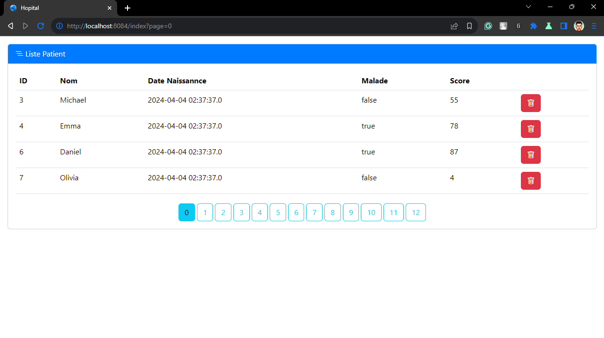
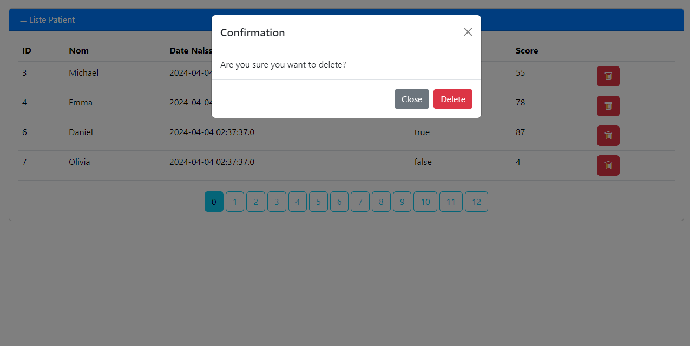

# Hospital Management System

This project implements a basic hospital management system using a Java Spring Boot framework. It allows for managing consultations, doctors, patients, appointments, and appointment statuses.

## Project Structure

The project follows a clear directory structure:

```
Hospital/
├── src/
│   ├── main/
│   │   ├── java/
│   │   │   └── ma.emsi.hopital/
│   │   │       ├── entities/  (Contains entity classes)
│   │   │       │   ├── Consultation.java
│   │   │       │   ├── Medecin.java
│   │   │       │   ├── Patient.java
│   │   │       │   ├── RendezVous.java
│   │   │       │   └── StatusRDV.java
│   │   │       └── repository/  (Contains repository interfaces)
│   │   │           ├── ConsultationRepository.java
│   │   │           ├── MedecinRepository.java
│   │   │           ├── PatientRepository.java
│   │   │           ├── RendezVousRepository.java
│   │   │           └── StatusRDVRepository.java
│   │   ├── resources/
│   │   │   ├── static/
│   │   │   │   └── Favicon.ico
│   │   │   └── templates/
│   │   │       └── patient.html  (HTML template for patient views)
│   └── test/  (Optional: Unit and integration tests)
└── pom.xml  (Project dependencies and configuration)
```

## Entities

- `Consultation.java`: Represents a consultation between a doctor and a patient.
- `Medecin.java`: Represents a doctor in the hospital system.
- `Patient.java`: Represents a patient registered in the hospital system.
- `RendezVous.java`: Represents an appointment scheduled between a doctor and a patient.
- `StatusRDV.java`: Represents the status of an appointment (e.g., Pending, Confirmed, Cancelled).

## Repositories

- Implement JPA repositories extending `CrudRepository` or creating custom interfaces for managing entities. These interfaces provide basic CRUD (Create, Read, Update, Delete) operations on the corresponding entities.

## Controllers

- `PatientController`: Handles requests related to patients, potentially including functionalities for adding, viewing, updating, and deleting patients.

## Templates

- `patient.html`: An HTML template used to display patient-related information within the web application.

## Getting Started

Prerequisites:

- Java Development Kit (JDK) 17 or higher
- Maven (Build tool)

Steps:

1. Clone this project or download the source code.
2. Open a terminal in the project directory.
3. Run `mvn clean install` to build the project.

Execution

(Replace with specific instructions based on your application setup)

1. Ensure you have a running database server (e.g., MySQL, PostgreSQL) configured for your project.
2. Run the application using a Java application server like Tomcat or embedded server provided by Spring Boot.
3. Access the application in your web browser, typically at `http://localhost:8080`.

Template Preview and Execution Deletion Preview

(Include placeholder text or links to external resources indicating where these previews will be displayed)

- Template Preview:
    - Provide a screenshot or code snippet demonstrating the `patient.html` template layout.
    - 
- Execution Deletion Preview:
    - Describe how to delete executed tasks or entries within the application and showcase this functionality through screenshots or instructions.
    - 

## Contribution

I welcome you to contribute to this project! Feel free to create pull requests with bug fixes, improvements, or new features.
